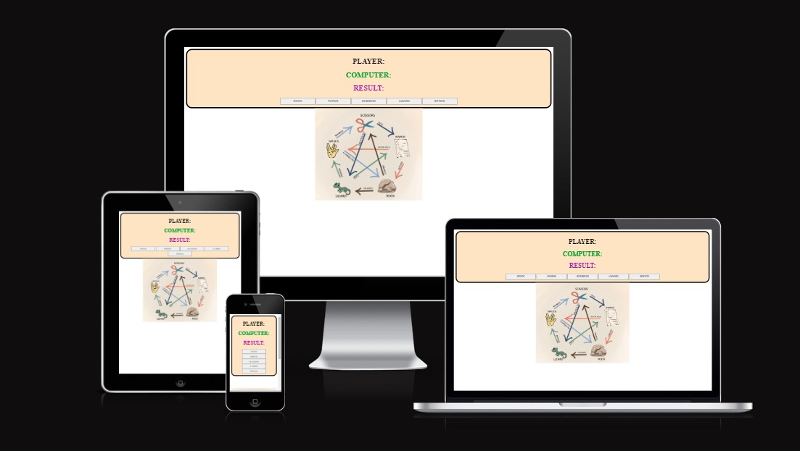
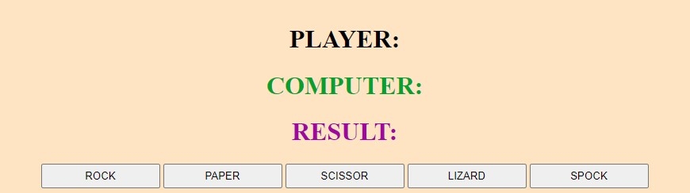
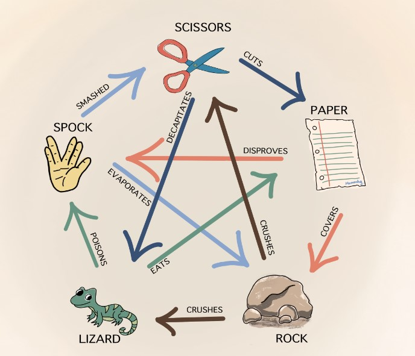

# Rock Paper, Scissor, Lizard, Spock. A classic game with a twist!

This game is made for those who doesn't have someone to play rock, paper, scissor, liard, spock with. Here you can play the game as much as you want. It's easy to use and is enjoyable for all ages.

You play against the computer, who picks a random option everytime.

## Features

In this section, you should go over the different parts of your project, and describe each in a sentence or so. You will need to explain what value each of the features provides for the user, focusing on who this website is for, what it is that they want to achieve and how your project is the best way to help them achieve these things.

### Existing Features

- __The Game Area__

  - This section will allow the user to play the game. The player will see the player and computer choice. When the player have choosen a option, the result will appear. There are buttons with five options which the player can chose from by clicking on them. The player can only chose one option at the time. 

- __The Rule Section__

  - This section shows a simple to understand picture with the game rules.

### Features Left to Implement

- A feature that could be added in the future is to track the score, set a score limit and reset score button. 

## Testing

I have played this game with multiple options to see if it works as intended. From my testing I haven't stumbled upon any problems with the game. It the computer picks a random option everytime and follows the rules on who won and lost.

The game works on different platforms and is adaptive and responsive.

I did not encounter any bugs. But I did have to try different options to make the game work with the addition of lizard and spock since the game was based on rock, paper and scissor.

### Validator Testing

- HTML
  - No errors were returned when passing through the official [W3C validator](https://validator.w3.org/nu/?doc=https%3A%2F%2Frebazp.github.io%2FProject2%2F)
- CSS
  - No errors were found when passing through the official [(Jigsaw) validator](https://jigsaw.w3.org/css-validator/validator?uri=https%3A%2F%2Frebazp.github.io%2FProject2%2F&profile=css3svg&usermedium=all&warning=1&vextwarning=&lang=sv)
- JavaScript
  - No errors were found when passing through the official [Jshint validator](https://jshint.com/)
    - The following metrics were returned:
    - There are 5 functions in this file.
    - Function with the largest signature takes 1 arguments, while the median is 0.
    - Largest function has 7 statements in it, while the median is 2.
    - The most complex function has a cyclomatic complexity value of 17 while the median is 1.

### Unfixed Bugs

There is no unfixed bugs.

## Deployment

This section should describe the process you went through to deploy the project to a hosting platform (e.g. GitHub)

- The site was deployed to GitHub pages. The steps to deploy are as follows:
  - In the GitHub repository, navigate to the Settings tab
  - From the source section drop-down menu, select the Master Branch
  - Once the master branch has been selected, the page will be automatically refreshed with a detailed ribbon display to indicate the successful deployment.

The live link can be found here - <https://code-institute-org.github.io/love-maths/>

## Credits

The code that I've used in this project comes from youtube channel [Bro Code](https://www.youtube.com/watch?v=n1_vHArDBRA&ab_channel=BroCode)

### Content

- The game area comes from [Bro Code] rock, paper, scissor game (https://www.youtube.com/watch?v=n1_vHArDBRA&ab_channel=BroCode)
- Picture with instructions on how to play the game comes from (https://www.momonhg.com/blog/rock-paper-scissors-lizard-and-spock-game)

### Media

- The photos used in this game comes from this blog (<https://www.momonhg.com/blog/rock-paper-scissors-lizard-and-spock-game>)