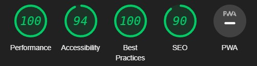

# Rock, Paper, Scissor, Lizard, Spock. A classic game with a twist

This game is made for entertainmet purpose for those who want to play rock, paper, scissor, lizard, spock with. Here you can play the game as much as you want by yourself against the computer. It's easy to use and is enjoyable for all ages.

You play against the computer which picks a random option everytime.

## Features

The game have two main objects. One area for the game where the player chose one option (rock, paper, scissor, lizard, spock). When the player have chosen one option the computer will immediately also chose one random option. Based on the rules. The game either ends in win, lose or draw.

The second object is the picture showing the rules of the game. It's easy to understand with suitable icons for all ages.

### Existing Features

- __The Game Area__

  - This section will allow the user to play the game. The player will see the player and computer choice. When the player have chose a option, the result will appear. There are buttons with five options which the player can chose from by clicking on them. The player can only chose one option at the time.

- __The Rule Section__

  - This section shows a simple to understand picture with the game rules.

### Features Left to Implement

- A feature that could be added in the future is to track the score, set a score limit and reset score button.

## Testing

I have played this game with multiple options to see if it works as intended. From my testing I haven't stumbled upon any problems with the game. The computer picks one random option everytime and follows the rules on who won, lost or draw.

The game works on different platforms and is adaptive and responsive.

I did not encounter any bugs. But I did have to try different options to make the game work with the addition of lizard and spock since the game was based on rock, paper and scissor.

### Validator Testing

- HTML
  - No errors were returned when passing through the official [W3C validator](https://validator.w3.org/nu/?doc=https%3A%2F%2Fgithub.com%2Frebazp%2FRock-Paper-Scissor-Lizard-Spock.git#textarea)
- CSS
  - No errors were found when passing through the official [(Jigsaw) validator](https://jigsaw.w3.org/css-validator/validator?uri=https%3A%2F%2Frebazp.github.io%2FRock-Paper-Scissor-Lizard-Spock%2F&profile=css3svg&usermedium=all&warning=1&vextwarning=&lang=sv)
- JavaScript
  - No errors were found when passing through the official [Jshint validator](https://jshint.com/)
    - The following metrics were returned:
    - There are 5 functions in this file.
    - Function with the largest signature takes 1 arguments, while the median is 0.
    - Largest function has 7 statements in it, while the median is 2.
    - The most complex function has a cyclomatic complexity value of 17 while the median is 1.
- Accessibility
  - I confirmed that colors and fonts chosen are easy to read and accessible by running it through lighthouse in devtools.

### Unfixed Bugs

There is no unfixed bugs.

## Deployment

- The site was deployed to GitHub pages. The steps to deploy are as follows:
  - In the GitHub repository, navigate to the Settings tab
  - From the source section drop-down menu, select the Master Branch
  - Once the master branch has been selected, the page will be automatically refreshed with a detailed ribbon display to indicate the successful deployment.

The live link can be found here - [GitHub link](https://rebazp.github.io/Rock-Paper-Scissor-Lizard-Spock/)

## Credits

The code that I've used in this project is my own and from Youtube channels:

- [Bro Code](https://www.youtube.com/watch?v=n1_vHArDBRA&ab_channel=BroCode)
- [Coding with Jon](https://www.youtube.com/watch?v=Nb1YRElHVLc&t=3s&ab_channel=CodingwithJohn)

### Content

- The main game area and function comes from [Bro Code](https://www.youtube.com/watch?v=n1_vHArDBRA&ab_channel=BroCode)
- The winner area and code for lizard and spock comes from [Coding with Jon](https://www.youtube.com/watch?v=Nb1YRElHVLc&t=3s&ab_channel=CodingwithJohn) and [Bro Code](https://www.youtube.com/watch?v=n1_vHArDBRA&ab_channel=BroCode)
- The style and coloring code comes from [Bro Code](https://www.youtube.com/watch?v=n1_vHArDBRA&ab_channel=BroCode)
- Picture with instructions on how to play the game comes from [Momonhg](https://www.momonhg.com/blog/rock-paper-scissors-lizard-and-spock-game)

### Media

- The photos used in this game comes from a blog by [Momonhg](<https://www.momonhg.com/blog/rock-paper-scissors-lizard-and-spock-game>)
