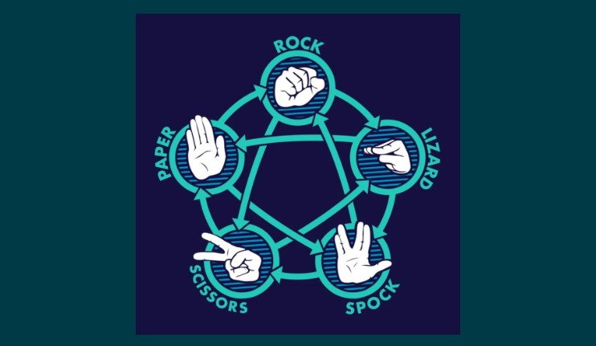
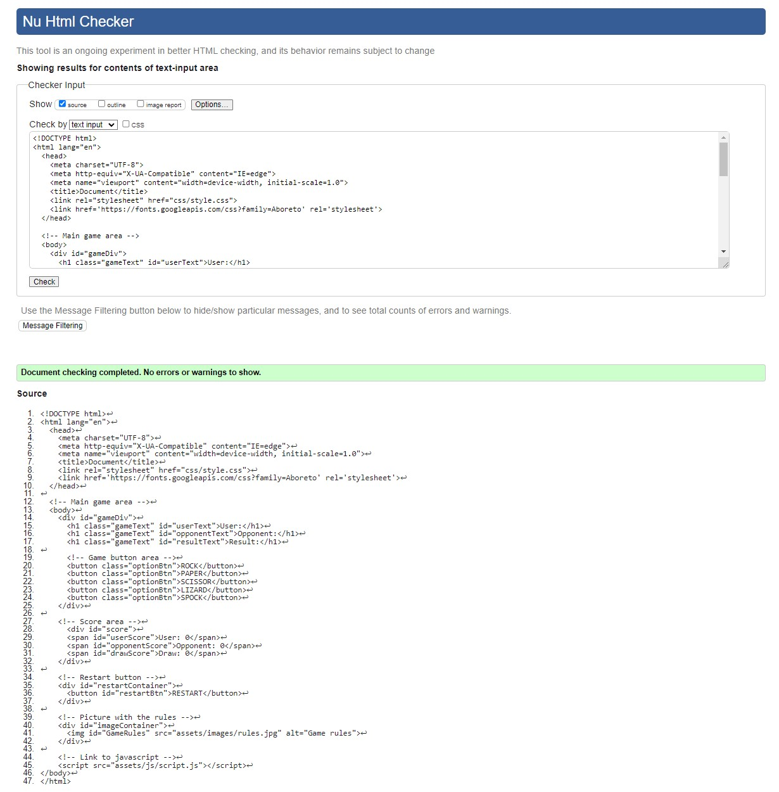
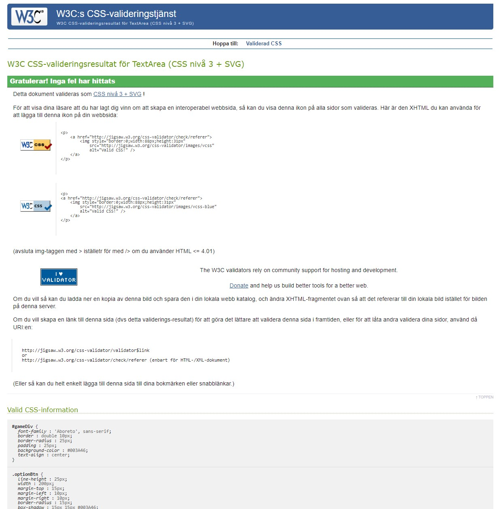
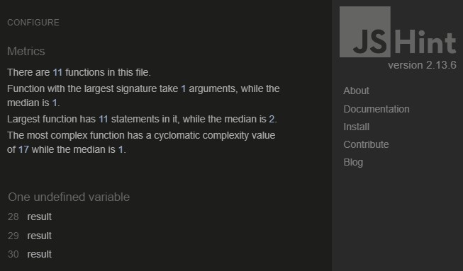
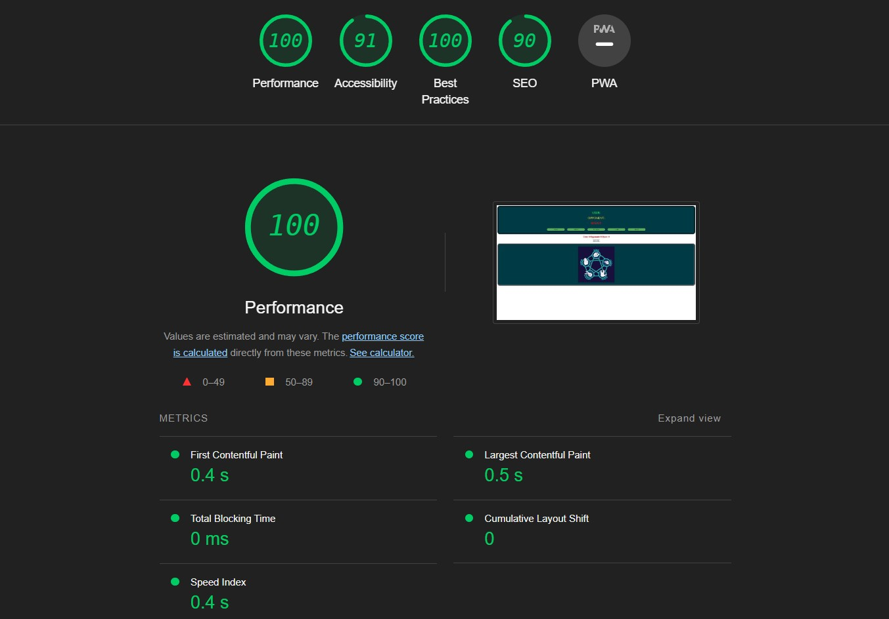

# ROCK - PAPER - SCISSOR - LIZARD - SPOCK

This game is made for entertainment purposes for those who want to play rock, paper, scissors, lizard, spock. Here you can play the game as much as you want by yourself against the computer. It's easy to use and enjoyable for all ages.

You play against the computer, which picks a random option every time. The results are shown, making it easy to keep track of the score. When the game reaches 10 turns, the game stops and the user will have to press the restart button to play again.

- [View Live Version Here](https://rebazp.github.io/P2RPSLSGame/)

# Table of Contents
* [Features](#features)
* [Testing](#testing)
* [Validator Testing](#validator-testing)
* [Bugs](#bugs)
* [Deployment](#deployment)
* [Credits](#credits)
* [Acknowledgement](#acknowledgement)

## Features

- The game has five main components. One area is designated for the game, where the player chooses one option (rock, paper, scissors, lizard, spock). Once the player has chosen an option, the computer immediately selects a random one as well. Based on the rules, the game can end in a win, loss, or draw.

- The second component is to keep track of the results. The player's, computer's, and draw scores are displayed and updated after every turn.

- The third component is a picture showing the rules of the game. It's easy to understand, with suitable icons for all ages.

- The fourth component let's the player restart the game.

- The fifth component stops the game after 10 turns and disable the option buttons.

### Existing Features

- __Game Area__

  - This section will allow the user to play the game. The player will see their choice and the computer's choice. When the player has chosen an option, the result will appear. There are buttons with five options from which the player can choose by clicking on them. The player can only choose one option at a time.

- __Score Section__

  - This section shows the current score of the game.

- __Restart Section__

  - This section let's the player restart the game.

- __Rule Section__

  - This section shows a simple to understand picture with the game rules.

## Testing

I have played this game many times with multiple options to see if it works as intended. From my testing, I haven't stumbled upon any problems with the game. The computer picks one random option every time and follows the rules on who won, lost, or drew.

The game works on different platforms and is adaptive and responsive.

## Validator Testing

- HTML
  - No errors were returned when passing through the official [W3 Markup Validation](https://validator.w3.org/) 
- CSS
  - No errors were found when passing through the official [W3C CSS Validation](https://jigsaw.w3.org/css-validator/) 
- JavaScript
  - No errors were found when passing through the official [JsHint](https://jshint.com/) 
    - The following metrics were returned:
    - There are 11 functions in this file.
    - Function with the largest signature takes 1 arguments, while the median is 1.
    - Largest function has 11 statements in it, while the median is 2.
    - The most complex function has a cyclomatic complexity value of 17 while the median is 1.
- Accessibility
  - I confirmed that colors and fonts chosen are easy to read and accessible by running it through lighthouse in devtools.

## Bugs

I did not encounter any bugs, but I had to try different options to make the game work with the addition of lizard and spock, as the main game code was based on rock, paper, and scissors.

### Unfixed Bugs

There is no unfixed bugs.

## Deployment

- The site was deployed to GitHub pages. The steps to deploy are as follows:
  - In the GitHub repository, navigate to the Settings tab
  - From the source section drop-down menu, select the Master Branch
  - Once the master branch has been selected, the page will be automatically refreshed with a detailed ribbon display to indicate the successful deployment.

The live link can be found here - [GitHub link](https://rebazp.github.io/P2RPSLSGame/)

## Credits

The code that I've used in this project is my own and inspired from tutorials and Youtube channels:

- [JavaScriptInfo](https://javascript.info)
- [W3Schools](https://www.w3schools.com)
- [Bro Code](https://www.youtube.com/watch?v=n1_vHArDBRA&ab_channel=BroCode)
- [Coding with Jon](https://www.youtube.com/watch?v=Nb1YRElHVLc&t=3s&ab_channel=CodingwithJohn)

## Content

- The fonts used in this project are Aboreto, sans-serif.
- The main game area and function is inspired from [Bro Code](https://www.youtube.com/watch?v=n1_vHArDBRA&ab_channel=BroCode), [JavaScriptInfo](https://javascript.info) and [W3Schools](https://www.w3schools.com)
- The winner function and code for lizard and spock is inspired from [Coding with Jon](https://www.youtube.com/watch?v=Nb1YRElHVLc&t=3s&ab_channel=CodingwithJohn),  [Bro Code](https://www.youtube.com/watch?v=n1_vHArDBRA&ab_channel=BroCode) and [W3Schools](https://www.w3schools.com)
- The score and restart function is inspired from [W3Schools](https://www.w3schools.com) and [JavaScriptInfo](https://javascript.info)
- The style and coloring is inspired from [Bro Code](https://www.youtube.com/watch?v=n1_vHArDBRA&ab_channel=BroCode) and [W3Schools](https://www.w3schools.com)
- Picture with instructions on how to play the game comes from a blog made by [Akshay Bahadur](https://akshaybahadur.medium.com/rock-paper-scissors-lizard-spock-%EF%B8%8F-514f0a2b8c1a)

### Media

- The photos used in this game comes from a blog by [Akshay Bahadur](https://akshaybahadur.medium.com/rock-paper-scissors-lizard-spock-%EF%B8%8F-514f0a2b8c1a)

## Acknowledgement

- I would like to thank my mentor Rohit Sharma and the community at slack.